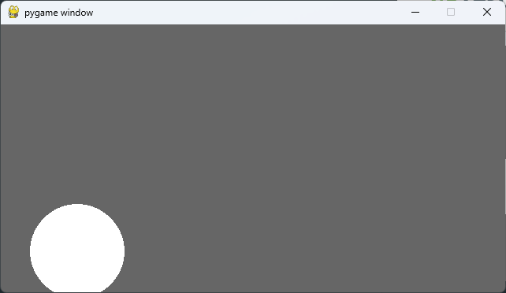
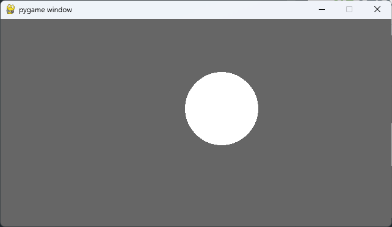
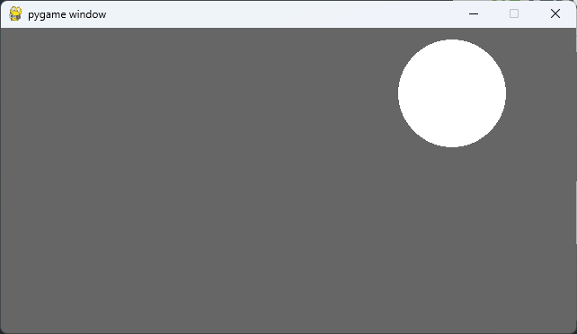

# 물리 운동 구현

#### **등속도 운동에 대하여**

</br>

##### 김창훈 | 수택고등학교 | 2학년

---

# ✨ Project Information

### | **준비 기간**

  </br>

###### 1개월

</br>

### | **관련 교과**

  </br>

###### `Computer Science`, `Math`, `physics`

---

# 📝 프로젝트 내용

### | 탐구 동기

학교 물리 수업 시간에 등속도 운동에 대해 배운 후, 실제 등속도 운동을 하는 사례가 내 주변에 있을까 고민하던 중, 프로그래밍 언어 python을 이용해 등속도 운동을 구현해보면, 실제 움직이는 프로젝트를 통해 등속도 운동에 대해 보다 깊이 이해할 수 있을 것 같다는 느낌이 들어서 탐구하게 되었다.

---

# 📝 프로젝트 내용

### | 주제

학교 수업시간에 배운 등속도 운동을 기반으로 등속도 운동을 하는 공의 움직임을 pygame으로 구현해 심화 탐구한다.

---

# 📝 프로젝트 내용

### | 교과 연관성

과학 물리시간에 배운 등속도 운동이고 운동과 연관되므로 물리학과 밀집하게 연관되있고, 컴퓨터 코딩이나 실제 공식을 통해 나타낼 수 있으므로 수학과도 연관되 있다고 할 수 있다. 또, 이 프로젝트를 구현하는데 컴퓨터 과학도 사용되었다고 할 수 있다.

---

# 📝 프로젝트 내용

### | 활동 내용

pygame 모듈을 불러와 프로젝트에 필요한 함수와 문장을 가져오고, 스크린의 가로세로 길이와 공의 x좌표와 y좌표, 그리고 공의 속도를 설정한다. QUIT버튼을 누를때까지 게임이 지속되는 코드를 while문으로 나타내고, 설정한 공의 위치와 속도로 공이 나타나게 하였다. 마지막으로 프로젝트를 실행하는 문장을 쓰고 등속도 운동을 하는 공의 프로젝트를 코딩하였다.

---

# 📝 프로젝트 내용

### | 생기부 기재 추천 문구

수업시간에 배운 등속도 운동을 파이썬 언어를 사용하여 구현해 심화 탐구하였다. 

---

## 💡 code

- #### import modules

```python
import pygame

pygame.init()
```

---

## 💡 code

- #### set data

```python
SCREEN_WIDTH = 640
SCREEN_HEIGHT = 340

xpos = 0
ypos = SCREEN_HEIGHT

xspeed = 0.001 * SCREEN_WIDTH
yspeed = -0.001 * SCREEN_HEIGHT

screen = pygame.display.set_mode((SCREEN_WIDTH, SCREEN_HEIGHT))
```

---

## 💡 code

- #### read data

```python
run = True
while run:
    screen.fill((102, 102, 102))

    for event in pygame.event.get():
        if event.type == pygame.QUIT:
            run = False

    xpos = xpos + xspeed
    ypos = ypos + yspeed

    pygame.draw.circle(screen, (255, 255, 255), (xpos, ypos), 60)
    pygame.display.update()
```

---

## ✅ result



---

## ✅ result



---

## ✅ result

