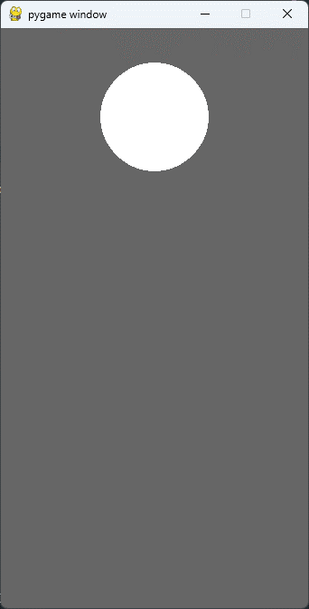
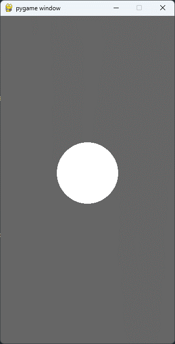
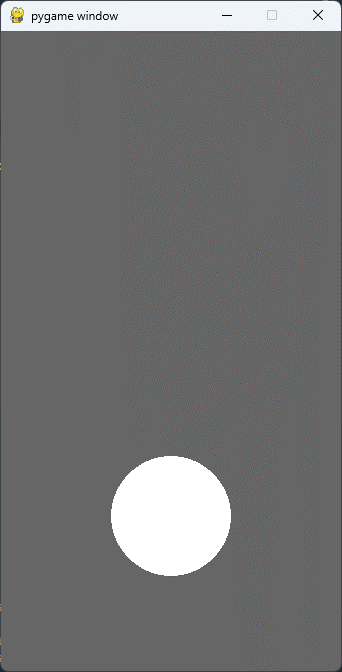

# 물리 운동 구현

#### **공기저항을 받는 자유낙하 운동에 대하여**

</br>

##### 김창훈 | 수택고등학교 | 2학년

---

# ✨ Project Information

### | **준비 기간**

  </br>

###### 1주

</br>

### | **관련 교과**

  </br>

###### `Computer Science`, `Math`, `physics`

---

# 📝 프로젝트 내용

### | 탐구 동기

학교 물리 수업 시간에 자유낙하 운동에 대해 배울 때, 공기 저항은 무시하는 경우가 많고, 실제 자유낙하 운동 실험을 하게 되도 등가속도 운동을 한다고 크게 체감이 되지 않는 경우가 많았기에, 이 공기저항에 대해 관심이 생겨 공기저항을 받는 자유낙하 운동을  프로그래밍 언어 python을 이용해 구현해 공기저항에 대해 자세히 알아보고자 이 프로젝트를 만들게 되었다.

---

# 📝 프로젝트 내용

### | 주제

학교 수업시간에 배운 자유낙하 운동에 공기 저항을 받게 하는 물리 운동을 하는 공의 움직임을 pygame으로 구현해 심화 탐구한다.

---

# 📝 프로젝트 내용

### | 교과 연관성

과학 물리시간에 배운 자유낙하 운동에 가해지는 공기저항을 탐구하는 내용이기에 물리 운동을 탐구한다고 볼 수 있기에 물리학과 관련이 있고, 수학적 연산이 들어간다는 점에서 수학과도 연관이 있다고 볼 수 있다. 또, 이 프로젝트를 구현하는데 컴퓨터 과학도 사용되었다고 할 수 있다.

---

# 📝 프로젝트 내용

### | 활동 내용

pygame 모듈을 불러와 프로젝트에 필요한 함수와 문장을 가져오고, 스크린의 가로세로 길이와 공의 x좌표와 y좌표, 그리고 공의 속도와 가속도를 설정한다. 또, 이 프로젝트의 메인 주제인 공기저항도 설정해준다. QUIT버튼을 누를때까지 게임이 지속되는 코드를 while문으로 나타내고, 설정한 공의 위치와 속도로 공이 나타나게 하였다. 마지막으로 프로젝트를 실행하는 문장을 쓰고 물리 운동을 하는 공의 프로젝트를 코딩하였다.

---

# 📝 프로젝트 내용

### | 생기부 기재 추천 문구

수업시간에 배운 자유낙하 운동의 공기저항에 대해 심화 탐구하였고, 파이썬 언어를 사용하여 구현해냈다. 

---

## 💡 UniformMotion code

- #### import modules

```python
import pygame

pygame.init()
```

---

## 💡 UniformMotion code

- #### set data

```python
SCREEN_WIDTH = 340
SCREEN_HEIGHT = 640

xpos = SCREEN_WIDTH/2
ypos = 0

yspeed = 0.001

gravity = 0.00005
resist = 0.9998

screen = pygame.display.set_mode((SCREEN_WIDTH, SCREEN_HEIGHT))
```

---

## 💡 UniformMotion code

- #### read data

```python
run = True
while run:
    screen.fill((102, 102, 102))
    for event in pygame.event.get():
        if event.type == pygame.QUIT:
            run = False

    gravity = gravity*resist
    yspeed = yspeed + gravity
    ypos = ypos + yspeed

    pygame.draw.circle(screen, (255, 255, 255), (xpos, ypos), 60)
    pygame.display.update()
```

---

## ✅ resist result



---

## ✅ resist result



---

## ✅ resist result

