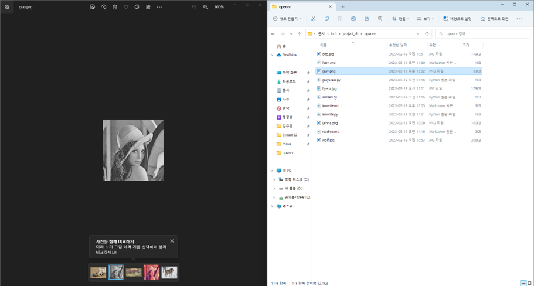

# 흑백 이미지 출력/저장 프로젝트

#### **이미지를 흑백이미지로 출력하고 저장하는 과정 **

</br>

##### 김창훈 | 수택고등학교 | 2학년

---

# ✨ Project Information

### | **준비 기간**

  </br>

###### 1주일

</br>

### | **관련 교과**

  </br>

###### `Computer Science`, `Math`

---

# 📝 프로젝트 내용

### | 탐구 동기

흑백 이미지가 만들어지는 과정이 궁금해졌고, 탐구하는 와중에 흑백 이미지를 출력하고 저장하는 프로젝트를 만들면 어떨까 생각하게 되어, 프로젝트를 구상하고 실행에 옮겼다.

---

# 📝 프로젝트 내용

### | 주제

흑백 이미지를 출력하고 저장하는 프로젝트를 만들어 이미지가 흑백으로 변화하는 과정을 깊게 탐구한다.

---

# 📝 프로젝트 내용

### | 교과 연관성

이미지 자료를 편집하고 변환할 때 인공지능이 이미지 자료를 인식하기 위해서는 이미지 자료를 수치화하여 행렬로 표현해야 한다. 이미지 자료를 행렬로 표현하면 행렬의 연산을 이용하여 목적에 맞게 이미지를 변형하여 사용할 수 있다. 이미지 자료를 인공지능이 인식하도록 변환하는 데 수학적 원리가 사용된다는 점에서 수학과 연관이 있다고 볼 수 있고, 프로젝트를 만들고 구상하는데 컴퓨터 과학이 사용되었다고 볼 수도 있다.

---

# 📝 프로젝트 내용

### | 활동 내용

실시간 이미지 처리 기술 모듈인 cv2 모듈을 불러오고, 파일의 경로에 따라 이미지를 불러왔다. 이미지 자료가 수치화되있는 행렬도 불러와 확인하였고, 이미지를 흑백화하는 코드를 작성해 흑백 이미지를 출력하는 코드가 만들어졌고, 그 후 흑백화된 이미지가 자동으로 저장되는 프로젝트를 만들어 내었다.

---

# 📝 프로젝트 내용

### | 생기부 기재 추천 문구


---

## 💡 code

- #### import modules

```python
import cv2
```

---

## 💡 code

- #### read data

```python
file_path = "opencv\Lenna.png"

img = cv2.imread(file_path)

print(img)

cv2.imshow('Lenna', img)
cv2.waitKey(0)
cv2.destroyAllWindows()
```

---

## ✅ result


---

## ✅ result

